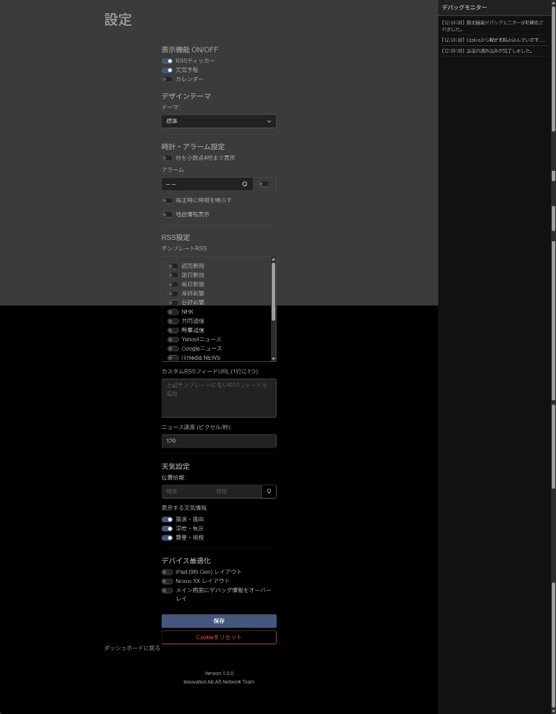

# Info Server (デジタルダッシュボード)

[English](./README.en.md)

**Info Server** は、iPadや古いタブレット（Nexus 5Xなど）を常時表示の情報端末として活用するためのデジタルダッシュボードアプリケーションです。時計、天気、ニュース、カレンダーなどの重要な情報を、美しくカスタマイズ可能なインターフェースで表示します。



## 主な機能

- **デジタル時計**: "Orbitron" フォントを使用した高精度時計（秒の小数点以下表示対応）。
- **天気情報**: OpenWeatherMap APIを使用したリアルタイム天気予報。
- **RSSニュースティッカー**: 複数のRSSフィードに対応したスクロールニュースバー（プリセットおよびカスタムURL対応）。
- **カレンダー**: 日本の祝日に対応した月表示カレンダー。
- **地震速報**: P2PQuake APIを使用した地震情報の表示。
- **テーマ機能**: 気分に合わせて選べるデザインテーマ（標準、ブレードランナー風、エヴァンゲリオン風、2001年宇宙の旅風）。
- **デバイス最適化**: iPad (第9世代) および Nexus 5X 向けの専用レイアウトモード。
- **Web設定画面**: ブラウザから簡単に設定変更が可能。
- **スマートキャッシュ**: APIレスポンスのキャッシュを無効化し、常時稼働中のデバイスストレージ圧迫を防止。

## 必要要件

- **Node.js**: v14 以降推奨。
- **OpenWeatherMap API Key**: 天気情報の取得に必要です。

## インストール方法

1. **リポジトリをクローン:**
   ```bash
   git clone https://github.com/yourusername/Info-server.git
   cd Info-server
   ```

2. **依存関係をインストール:**
   ```bash
   npm install
   ```

3. **環境変数の設定:**
   ルートディレクトリに `.env` ファイルを作成し、OpenWeatherMapのAPIキーを設定してください:
   ```env
   OPENWEATHERMAP_API_KEY=your_api_key_here
   ```

## 使い方

1. **サーバーを起動:**
   ```bash
   npm start
   ```

2. **ダッシュボードにアクセス:**
   ブラウザで `http://localhost:3000` にアクセスします。

3. **設定の変更:**
   画面上の歯車アイコン (⚙️) をクリックするか、`http://localhost:3000/settings.html` にアクセスして、テーマや表示項目をカスタマイズできます。

## ライセンス

This project is licensed under the ISC License.
